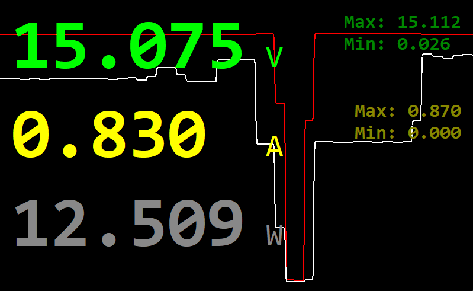

# Qianli iBridge A3 PC Monitor

Reverse-engineered Python client and visualization tool for the **Qianli iBridge A3** USB Tester (Tail-YCS).



## Features
- **Live Monitoring:** Real-time Voltage and Current readings.
- **Visual Interface:** Digital Multimeter style GUI with scrolling graph (`visual_monitor.py`).
- **Python API:** Simple `QianliClient` class for integration into other tools.

## Installation
1. Install Python 3.x.
2. Install dependencies:
   ```bash
   pip install pyserial tk
   ```

## Usage

### 1. Visual Monitor (GUI)
The recommended way to use the tool.
```bash
python visual_monitor.py COMx
```
*(Replace `COMx` with your specific COM port, e.g., `COM5` on Windows or `/dev/ttyUSB0` on Linux).*

### 2. Python API
Use the library in your own scripts:
```python
from QianliClient import QianliClient

client = QianliClient("COM5")
if client.connect():
    client.enable_stream()
    v, i, t = client.get_latest_reading()
    print(f"Voltage: {v} V")
```

## Protocol Details

**Connection:** USB Serial, 115200 baud, 8N1.

### Packet Structure
The protocol uses a fixed-header variable-length packet format.

| Offset | Field | Type | Size | Description |
| :--- | :--- | :--- | :--- | :--- |
| 0 | **Magic** | `uint8` | 1 | Always `0xDA` |
| 1 | **Length** | `uint16_le` | 2 | Size of **Payload** only (Little Endian) |
| 3 | **Model** | `uint8` | 1 | Device Mode / Target (e.g., `0x04`) |
| 4 | **Command** | `uint8` | 1 | Command ID (e.g., `0x05`) |
| 5 | **Param 1** | `uint8` | 1 | Parameter 1 (Usually `0x00`) |
| 6 | **Param 2** | `uint8` | 1 | Parameter 2 (Usually `0x00`) |
| 7 | **Checksum** | `uint8` | 1 | XOR of all **Payload** bytes (0 if Len=0) |
| 8 | **Payload** | `bytes` | *Length* | Variable length data |

### Commands
- **Enable Stream:** `Model 04` `Cmd 05` `Payload 00`
- **Disable Stream:** `Model 04` `Cmd 05` `Payload 01`

### Data Stream Format
Response to `Model 04 Cmd 05`: Payload is **8 bytes**.

| Offset | Field | Type | Size | Scaling |
| :--- | :--- | :--- | :--- | :--- |
| 0 | **Current** | `uint32_be` | 4 | `Val / 10000.0` = **Amperes** |
| 4 | **Voltage** | `uint32_be` | 4 | `Val / 1000.0` = **Volts** |

*Note: Data values are Big Endian.*
