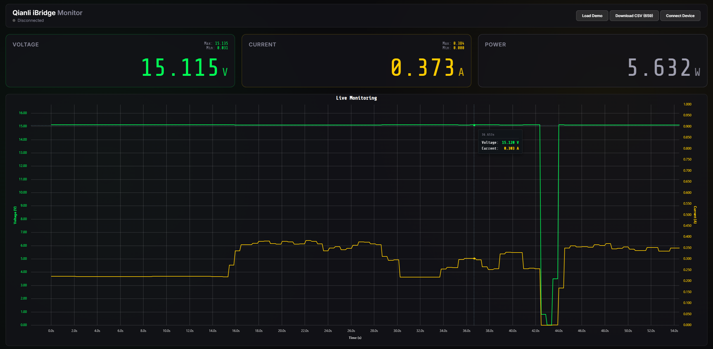

# Qianli iBridge A3 PC Monitor

A reverse-engineered Python client, graphical desktop application, and web-based visualization tool for the Qianli iBridge A3 USB Tester (Tail-YCS).

## Overview
The Qianli iBridge A3 lacks native PC connectivity out of the box. This project reverse-engineers the serial protocol over USB to enable real-time tracking, logging, and visualization of voltage and current data.

### 1. Web Monitor (WebUSB)
The quickest way to get started. A lightweight, zero-installation web interface available directly in the browser via WebUSB.

**[Launch the Web Monitor](https://creased.github.io/Qianli-iBridge-A3-Monitor/web/)**

*Note: Requires a WebUSB-compatible browser such as Google Chrome, Microsoft Edge, or Opera.*



### 2. Desktop Visual Monitor
A Python-based desktop application providing a digital multimeter-style GUI and a scrolling history graph.


### 3. Python API
A simple, reusable `QianliClient` class that allows developers to integrate real-time readings into their own automation or testing scripts.

---

## Installation (Desktop & API)

1. Ensure Python 3.x is installed.
2. Install the required dependencies:
   ```bash
   pip install pyserial tk
   ```

## Usage

### Desktop GUI
Launch the visual monitor by passing your device's COM port as an argument:
```bash
python visual_monitor.py COMx
```
*(Replace `COMx` with your specific serial port, e.g., `COM5` on Windows or `/dev/ttyUSB0` on Linux).*

### Python Implementation
To use the underlying library directly within your own scripts:
```python
from QianliClient import QianliClient

client = QianliClient("COM5")
if client.connect():
    client.enable_stream()
    voltage, current, time = client.get_latest_reading()
    print(f"Voltage: {voltage} V, Current: {current} A")
```

---

## Protocol Documentation

The reverse-engineered protocol specifications for the serial communication.

**Connection Parameters:** USB Serial, 115200 baud, 8N1.

### Packet Structure
The protocol uses a fixed-header, variable-length packet format.

| Offset | Field        | Type        | Size | Description                                   |
| ------ | ------------ | ----------- | ---- | --------------------------------------------- |
| 0      | **Magic**    | `uint8`     | 1    | Constant `0xDA`                               |
| 1      | **Length**   | `uint16_le` | 2    | Size of the **Payload** buffer (Little Endian)|
| 3      | **Model**    | `uint8`     | 1    | Device Mode / Target (e.g., `0x04`)           |
| 4      | **Command**  | `uint8`     | 1    | Command ID (e.g., `0x05`)                     |
| 5      | **Param 1**  | `uint8`     | 1    | Parameter 1 (Usually `0x00`)                  |
| 6      | **Param 2**  | `uint8`     | 1    | Parameter 2 (Usually `0x00`)                  |
| 7      | **Checksum** | `uint8`     | 1    | XOR of all **Payload** bytes (0 if Len=0)     |
| 8      | **Payload**  | `bytes`     | Len  | Variable length data                          |

### Control Commands
- **Enable Data Stream:** `Model 04` `Cmd 05` `Payload 00`
- **Disable Data Stream:** `Model 04` `Cmd 05` `Payload 01`

### Data Stream Payload Format
When enabled, the device responds to `Model 04 Cmd 05` with an 8-byte payload.

| Offset | Field       | Type        | Size | Scaling Factor                 |
| ------ | ----------- | ----------- | ---- | ------------------------------ |
| 0      | **Current** | `uint32_be` | 4    | `Value / 10000.0` = **Amperes**|
| 4      | **Voltage** | `uint32_be` | 4    | `Value / 1000.0` = **Volts**   |

*Note: All data values in the payload are Big Endian.*
